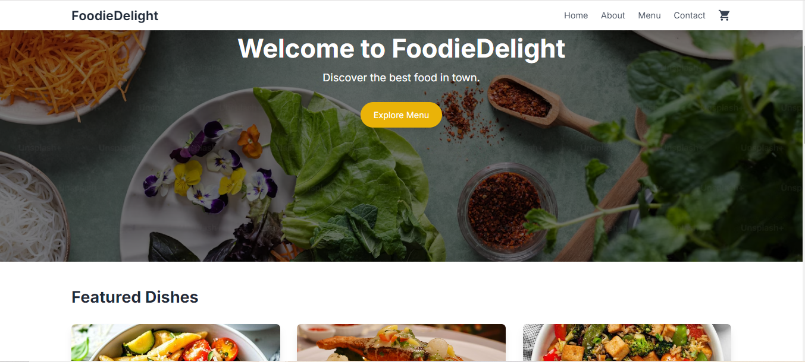

🍽️ FoodieDelight

Home Screen

FoodieDelight is a modern, sleek, and responsive web application that brings a delightful experience to food lovers. Featuring a beautiful home screen, animated interactions, and essential e-commerce functionalities like adding products to the cart, FoodieDelight is built with the latest web technologies to ensure smooth performance and user engagement.

🚀 Features
Beautiful Home Screen: A visually appealing and responsive landing page with high-quality food images.
Responsive Navbar: Navigate through different sections of the site with ease (Home, About, Menu, Contact, Cart).
Animated Transitions: Smooth animations on page load, scrolling, and interactions powered by Framer Motion.
Add to Cart Functionality: Seamless experience for adding items to the cart.
Infinite Scrolling: Load products dynamically as you scroll, giving a modern feel to the menu section.
Notifications: Real-time notifications using React Toastify for feedback and alerts.
🖥️ Tech Stack
React.js: Frontend library for building user interfaces.
Tailwind CSS: Utility-first CSS framework for quick styling and responsive design.
Framer Motion: Animations and transitions for a polished, interactive experience.
React Router DOM: For client-side routing between different pages.
Heroicons: Beautifully crafted icons to enhance the UI.
React Infinite Scroll Component: Smooth infinite scrolling for loading products dynamically.
React Toastify: Elegant toast notifications for user feedback.

🛠️ Installation and Setup
To run this project locally, follow these steps:

Clone the repository:

bash
Copy code
git clone https://github.com/Vineetkumar013/FoodieDelight.git
Navigate to the project directory:

bash
Copy code
cd foodiedelight
Install the dependencies:

bash
Copy code
npm install
Start the development server:

bash
Copy code
npm start
The app will run on http://localhost:3000.

🧑‍💻 Features In-Depth
1. Home Screen UI
The home screen greets users with a visually rich landing page, featuring high-quality food images and smooth entry animations, making a strong first impression.

2. Navbar
The responsive navbar allows users to navigate seamlessly through the app's sections (Home, About, Menu, Contact, and Cart). Tailwind CSS ensures the design is adaptive across devices.

3. Product Add to Cart
Each product on the menu can be easily added to the cart. Users receive instant feedback through toast notifications when an item is successfully added.

4. Animations
Leveraging Framer Motion, the app has fluid and engaging animations for page load, scroll effects, and button clicks, enhancing the user experience.

5. Infinite Scroll
The app features infinite scrolling for the product menu, loading more items as the user reaches the bottom of the page for a modern shopping experience.

🌐 Live Demo
Live Demo Link

🙌 Contributions
Feel free to contribute by submitting issues or pull requests. Contributions are always welcome!

📜 License
This project is licensed under the MIT License.